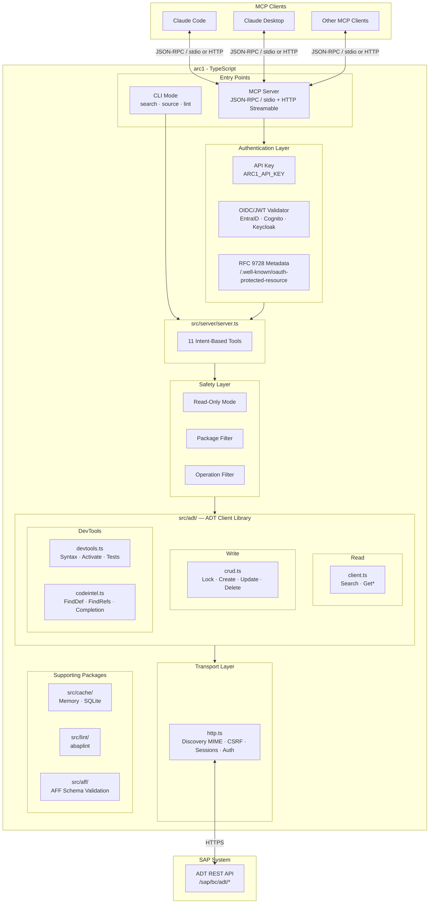
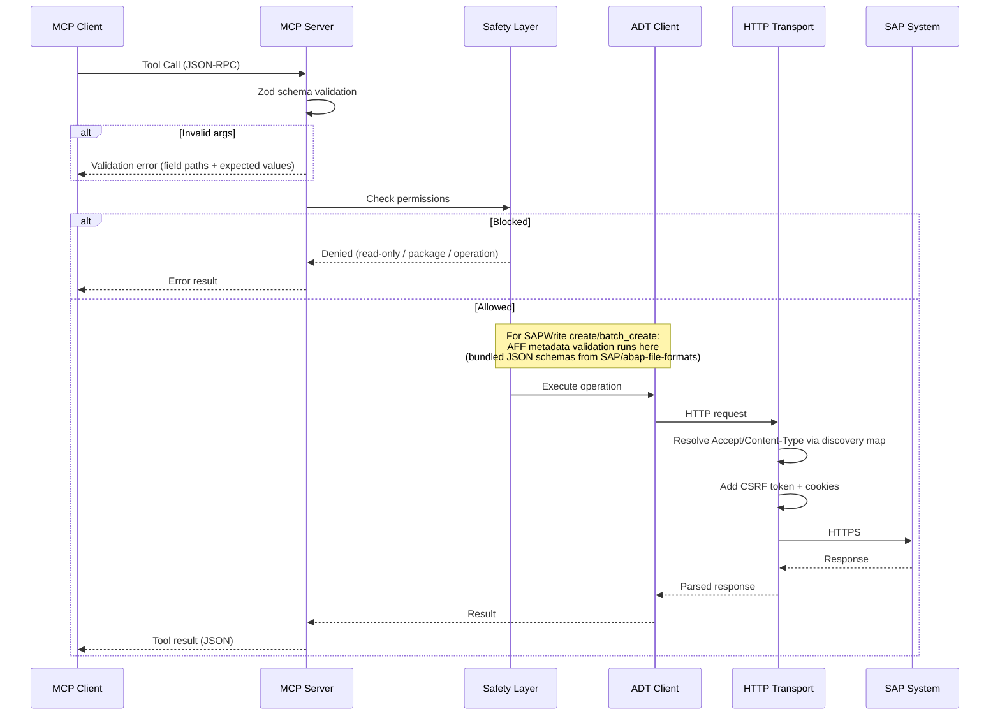
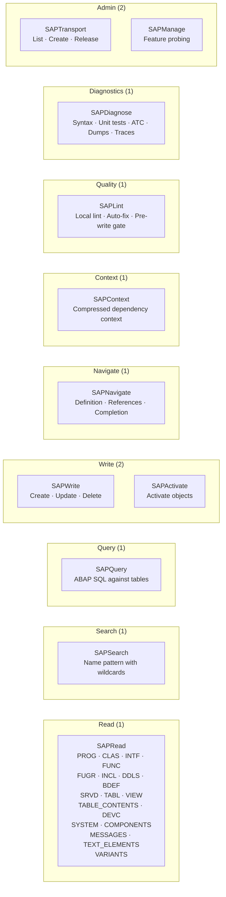
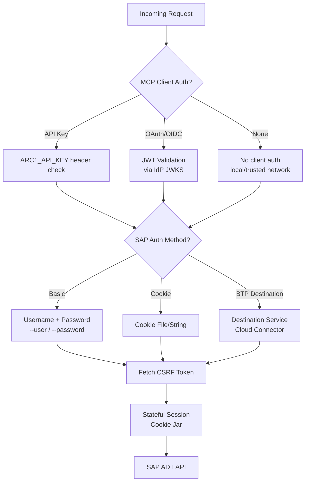
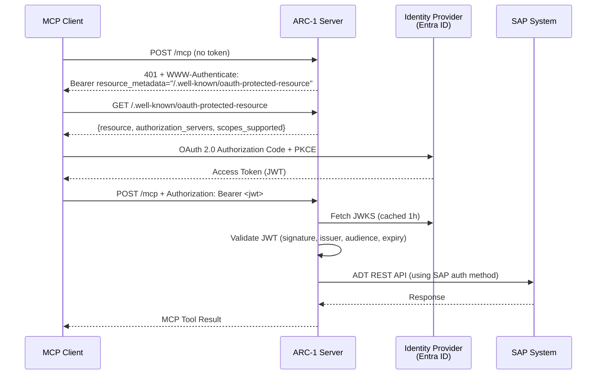
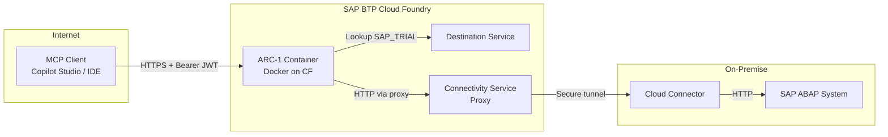
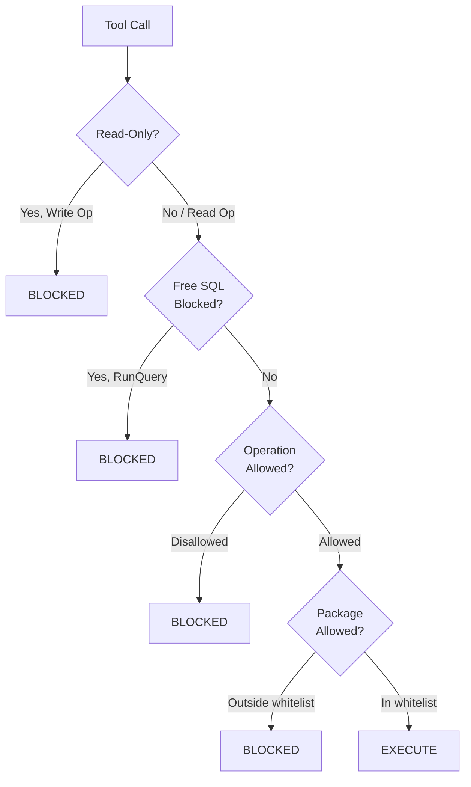

# ARC-1 Architecture

## High-Level Architecture



## Request Flow



## Tool Categories



## Package Structure

```
arc-1/
├── src/
│   ├── index.ts                    # MCP server entry point
│   ├── cli.ts                      # CLI entry point (commander)
│   ├── server/
│   │   ├── server.ts               # MCP server setup, tool registration
│   │   ├── config.ts               # Config parser (CLI > env > .env > defaults)
│   │   ├── http.ts                 # HTTP Streamable transport + API key/OIDC auth
│   │   ├── logger.ts               # Structured logger (stderr only)
│   │   └── types.ts                # ServerConfig type, defaults
│   ├── handlers/
│   │   ├── intent.ts               # 11 intent-based tool router (handleToolCall)
│   │   └── tools.ts                # Tool definitions (names, descriptions, schemas)
│   ├── adt/
│   │   ├── client.ts               # ADT client facade (all read operations)
│   │   ├── http.ts                 # HTTP transport (undici/fetch, discovery MIME, CSRF, cookies, sessions)
│   │   ├── discovery.ts            # ADT service discovery parser/lookup for MIME negotiation
│   │   ├── errors.ts               # Typed error classes (AdtApiError, AdtSafetyError)
│   │   ├── safety.ts               # Safety system (read-only, op filter, pkg filter)
│   │   ├── features.ts             # Feature detection (auto/on/off)
│   │   ├── config.ts               # ADT client configuration types
│   │   ├── types.ts                # ADT response types
│   │   ├── xml-parser.ts           # XML parser (fast-xml-parser v5)
│   │   ├── btp.ts                  # BTP Destination Service + Connectivity proxy
│   │   ├── cookies.ts              # Cookie file parsing (Netscape format)
│   │   ├── crud.ts                 # CRUD operations (lock, create, update, delete)
│   │   ├── devtools.ts             # Dev tools (syntax check, activate, unit tests)
│   │   ├── codeintel.ts            # Code intelligence (find def, refs, completion)
│   │   └── transport.ts            # CTS transport management
│   ├── cache/
│   │   ├── cache.ts                # Cache interface + types
│   │   ├── memory.ts               # In-memory cache
│   │   └── sqlite.ts               # SQLite cache (better-sqlite3)
│   ├── aff/
│   │   ├── validator.ts            # AFF JSON schema validation (Ajv 2020-12)
│   │   └── schemas/                # Bundled schemas from SAP/abap-file-formats
│   └── lint/
│       └── lint.ts                 # ABAP lint wrapper (@abaplint/core)
│
├── tests/
│   ├── unit/                       # Unit tests (no SAP system needed)
│   └── integration/                # Integration tests (need SAP credentials)
│
└── docs/                           # Documentation (MkDocs Material)
```

## Authentication

ARC-1 supports two independent authentication layers:

1. **MCP Client Auth** — authenticates the MCP client (API Key or OAuth/OIDC)
2. **SAP Auth** — authenticates to the SAP system (Basic, Cookie, or BTP Destination)



### OAuth/OIDC Flow (RFC 9728)



### BTP Cloud Foundry Deployment



## Safety System


