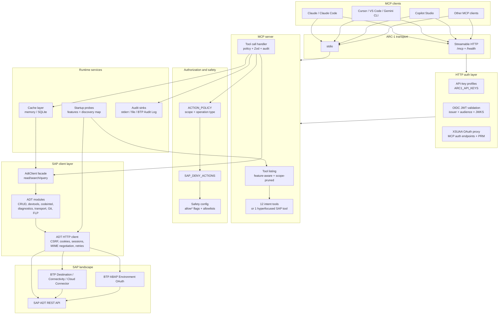
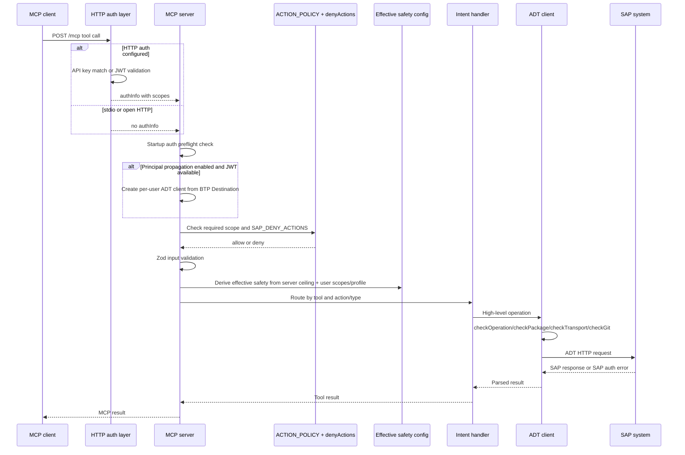
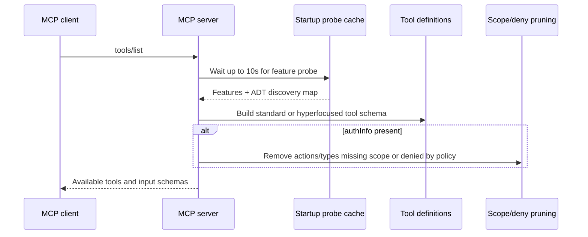
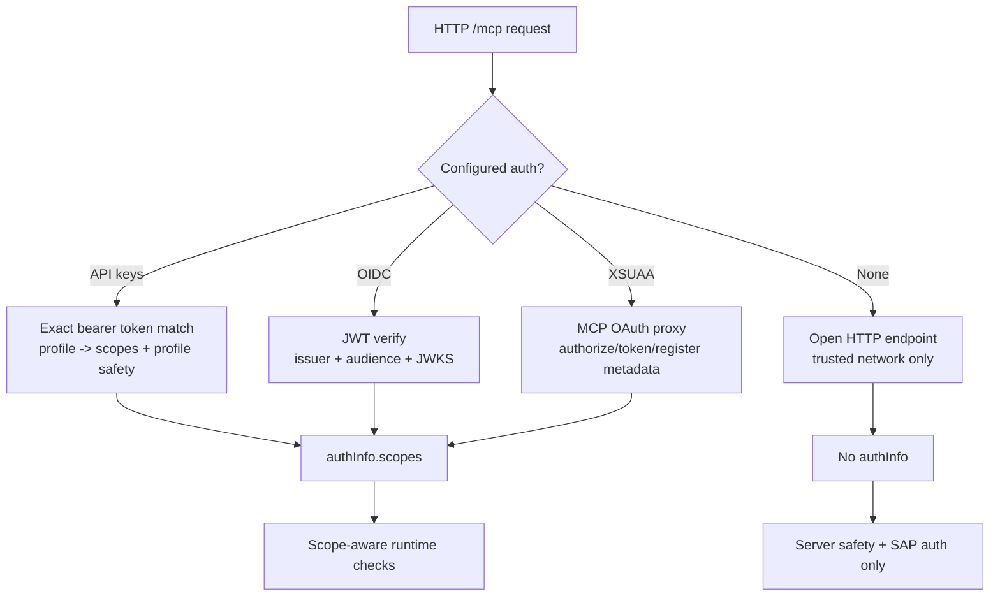
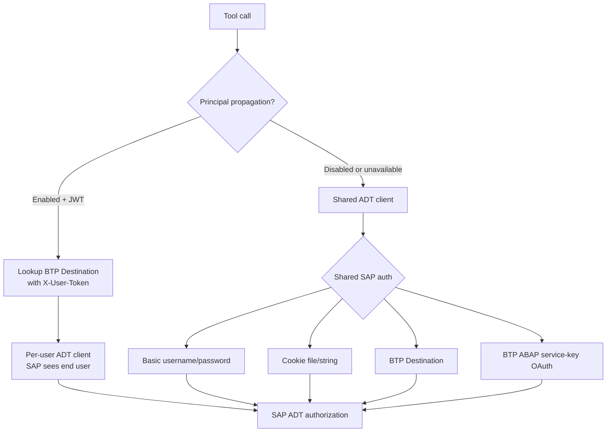
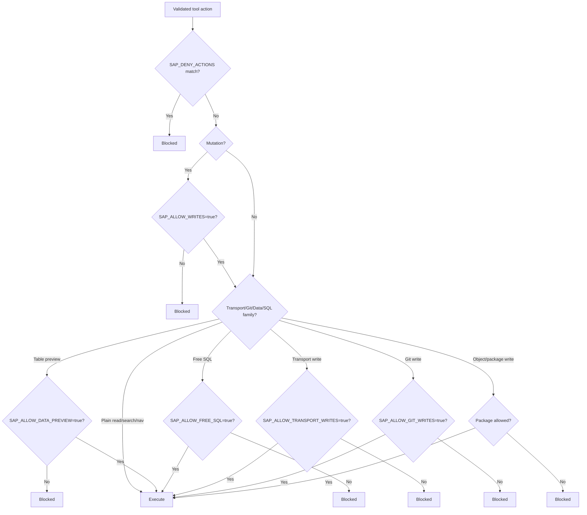
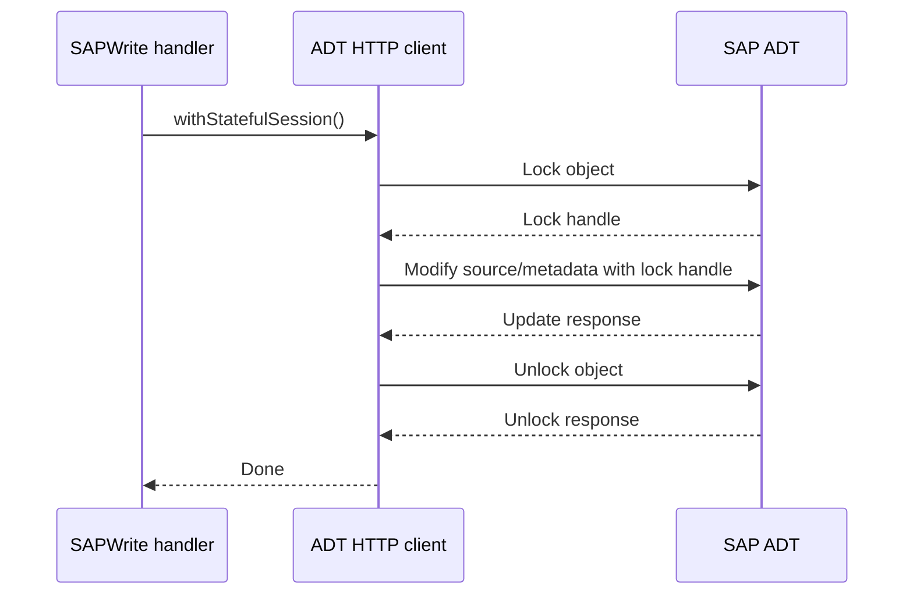
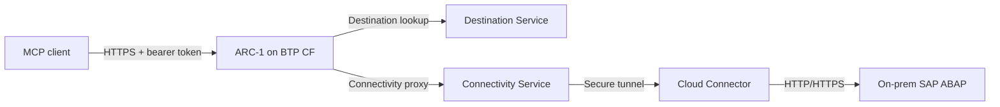

# ARC-1 Architecture

This page explains how ARC-1 is put together for admins, integrators, and future
maintainers. It focuses on the runtime path a user request takes, the security
gates that protect SAP, and the code areas to inspect when extending the server.

For a flat list of flags, see [Configuration Reference](configuration-reference.md).
For exact tool inputs, see [Tools Reference](tools.md). For authorization recipes,
see [Authorization & Roles](authorization.md).

## Current model

| Area | Current architecture |
| ---- | -------------------- |
| Runtime | TypeScript MCP server on Node.js 22+, distributed as npm package and Docker image. |
| MCP transports | `stdio` for local clients and `http-streamable` for hosted/server deployments. |
| Tool surface | Standard mode exposes 12 intent-based tools. Hyperfocused mode exposes one `SAP` tool. |
| SAP access | ADT REST APIs under `/sap/bc/adt/*`, plus selected OData/utility endpoints for UI5, Git, FLP, and diagnostics. |
| MCP auth | HTTP mode supports API-key profiles, OIDC JWTs, and XSUAA OAuth proxy mode. Stdio relies on local process trust. |
| SAP identity | Shared SAP credentials, BTP ABAP service-key OAuth, BTP Destination, or per-user principal propagation. |
| Safety | Server opt-in flags form the ceiling. User scopes and SAP authorization can only restrict further. |
| Cache | Memory cache for local stdio by default; SQLite for HTTP by default; optional startup warmup. |
| Observability | Structured logs and audit events to stderr, optional file sink, and optional BTP Audit Log sink. |

## High-level architecture



## Request flow

A tool call is intentionally gated more than once. ARC-1 blocks early when it can,
then SAP still performs the final authorization check with the SAP user identity.



The important invariant is:

```text
Effective permission = server safety ceiling AND user scope/profile AND SAP authorization
```

A user role can never expand what the ARC-1 instance was configured to allow.
If `SAP_ALLOW_WRITES=false`, no user can write, even with `admin` scope.

## Tool listing flow

Tool listing is dynamic. Users should treat the exposed schema as the server's
current capability view, not as a static contract copied from documentation.



Tool schemas also adapt to backend and configuration:

- `ARC1_TOOL_MODE=standard` exposes the intent tools.
- `ARC1_TOOL_MODE=hyperfocused` exposes one `SAP` tool with an `action` router.
- BTP mode hides or rewords classic object types that are not available in BTP ABAP Environment.
- Write actions appear only when the relevant server flags are enabled.
- `SAPGit` appears only when gCTS or abapGit is detected or forced on.
- `SAPTransport` appears unless the transport feature is forced off.

## Tool surface

Standard mode groups many ADT endpoints into 12 intent-based tools.

| Tool | Intent | Notes |
| ---- | ------ | ----- |
| `SAPRead` | Read ABAP objects, DDIC metadata, system info, UI5/BSP files, API state, revisions. | `TABLE_CONTENTS` needs data-preview permission. |
| `SAPSearch` | Object search and source-code search. | Source-code search depends on backend support. |
| `SAPWrite` | Create, update, delete, method surgery, RAP batch/scaffold actions. | Registered only when writes are enabled. |
| `SAPActivate` | Activate objects and publish/unpublish service bindings. | Registered only when writes are enabled. |
| `SAPNavigate` | Definition, references, completion, hierarchy. | Some ADT read endpoints use POST. |
| `SAPQuery` | Freestyle ABAP SQL. | Requires SQL scope and `SAP_ALLOW_FREE_SQL=true`. |
| `SAPContext` | Dependency context, usages, and CDS impact analysis. | Uses cache for reverse usages. |
| `SAPLint` | Local abaplint, formatting, formatter settings, pre-write validation helpers. | Formatter settings mutation needs write permission. |
| `SAPDiagnose` | Syntax, unit tests, ATC, quick fixes, dumps, traces, gateway errors, system messages. | Diagnostic reads can still execute backend checks. |
| `SAPManage` | Feature probe, cache stats, packages, package moves, FLP catalog/group/tile actions. | Read actions stay visible in read-only mode. |
| `SAPTransport` | CTS list/get/check/history and mutations. | Write actions require transport write opt-in. |
| `SAPGit` | gCTS and abapGit read/write operations. | Feature-gated by detected backend support. |

Hyperfocused mode maps one `SAP` action to the same underlying handlers:

| `SAP` action | Delegates to |
| ------------ | ------------ |
| `read` | `SAPRead` |
| `search` | `SAPSearch` |
| `query` | `SAPQuery` |
| `write` | `SAPWrite` |
| `activate` | `SAPActivate` |
| `navigate` | `SAPNavigate` |
| `context` | `SAPContext` |
| `lint` | `SAPLint` |
| `diagnose` | `SAPDiagnose` |
| `transport` | `SAPTransport` |
| `git` | `SAPGit` |
| `manage` | `SAPManage` |

The concrete delegated tool/action still enforces the real policy.

## Authentication and SAP identity

ARC-1 has two separate authentication questions:

| Question | Layer | Current options |
| -------- | ----- | --------------- |
| Who is calling ARC-1? | MCP client auth | API key profiles, OIDC JWT, XSUAA OAuth proxy, or no auth in trusted local mode. |
| Who is ARC-1 in SAP? | SAP auth | Basic credentials, cookies, BTP ABAP service-key OAuth, BTP Destination, or principal propagation. |

### HTTP auth modes



API-key and OIDC mode expect the client to send `Authorization: Bearer ...` to
`/mcp`. XSUAA mode additionally exposes MCP OAuth endpoints through the SDK auth
router, including protected-resource metadata for `/mcp`.

### SAP identity modes



In strict principal propagation mode (`SAP_PP_STRICT=true`), a request fails if
ARC-1 cannot build the per-user SAP client. Without strict mode, ARC-1 can fall
back to the shared client after logging an audit event.

## Safety system

The server safety config is the hard ceiling for the instance. It uses positive
opt-ins and starts restrictive by default.



Runtime policy is centralized in `src/authz/policy.ts`. It maps every tool
action/type to a user scope and internal operation type. `src/handlers/intent.ts`
checks that policy before input validation, and `src/server/server.ts` uses the
same policy to prune tool schemas during `tools/list`.

## ADT client and HTTP layer

The ADT client layer is intentionally split by domain so the main client facade
does not become one huge file.

| Area | Main files | Responsibility |
| ---- | ---------- | -------------- |
| Client facade | `src/adt/client.ts` | Read/search/query methods and shared client construction. |
| HTTP transport | `src/adt/http.ts` | CSRF tokens, cookies, stateful sessions, auth headers, retries, concurrency limit, MIME negotiation. |
| CRUD | `src/adt/crud.ts` | Lock/create/update/delete/unlock flows. |
| Activation and checks | `src/adt/devtools.ts` | Syntax, activation, preaudit handshake, unit tests, ATC, quick fixes, PrettyPrinter. |
| Code intelligence | `src/adt/codeintel.ts` | Definition, references, where-used, completion. |
| Diagnostics | `src/adt/diagnostics.ts` | Dumps, traces, gateway errors, system messages. |
| Transports | `src/adt/transport.ts` | CTS list/get/check/create/release/delete/reassign/history. |
| Git | `src/adt/gcts.ts`, `src/adt/abapgit.ts` | gCTS and abapGit operations. |
| BTP | `src/adt/btp.ts`, `src/adt/oauth.ts` | Destination Service, Connectivity proxy, BTP ABAP service-key OAuth. |
| UI tooling | `src/adt/ui5-repository.ts`, `src/adt/flp.ts` | UI5 repository and FLP catalog/group/tile operations. |
| Parsing | `src/adt/xml-parser.ts` | ADT XML and Atom response parsing. |

All ADT endpoints must be guarded by `checkOperation()` before the HTTP request.
Write paths also use package, transport, or Git-specific checks where relevant.

Stateful mutation patterns use the same ADT session for lock, modify, and unlock:



## Cache, probes, and audit

These services are cross-cutting rather than tied to one tool.

| Service | Main files | What it does |
| ------- | ---------- | ------------ |
| Cache | `src/cache/*` | Stores source, dependency graphs, dependency edges, node metadata, and function-group mappings. |
| Cache warmup | `src/cache/warmup.ts` | Pre-indexes custom objects so `SAPContext(action="usages")` can answer reverse dependency questions. |
| Feature probes | `src/adt/features.ts`, `src/probe/*` | Detects backend support and builds the ADT discovery map used for tool schemas and MIME negotiation. |
| Context compression | `src/context/*` | Extracts public contracts, CDS dependencies, method-level slices, and compact dependency context. |
| Lint | `src/lint/*` | Builds ABAP lint config and runs local lint/format/pre-write validation. |
| AFF validation | `src/aff/*` | Validates ABAP File Format metadata for selected create/batch-create paths. |
| Audit | `src/server/audit.ts`, `src/server/sinks/*` | Emits tool, auth, HTTP, elicitation, activation, and server lifecycle audit events. |

## Deployment patterns

| Pattern | Transport | Typical SAP auth | Best for |
| ------- | --------- | ---------------- | -------- |
| Local developer | `stdio` | Basic credentials, cookies, or BTP ABAP service key | One developer using a local MCP client. |
| Shared HTTP server | `http-streamable` | Shared Basic/cookie/destination credentials | Team sandbox or controlled internal service. |
| Enterprise HTTP | `http-streamable` | OIDC/XSUAA for MCP auth plus shared SAP auth | Centralized ARC-1 with per-user ARC-1 scopes. |
| Enterprise with SAP identity | `http-streamable` | OIDC/XSUAA plus BTP Destination principal propagation | SAP sees the real end user; strongest audit story. |
| BTP ABAP direct | either | Service-key OAuth with browser login/token refresh | Connecting directly to SAP BTP ABAP Environment. |

BTP Cloud Foundry with Destination Service and Cloud Connector looks like this:



With principal propagation, ARC-1 performs the destination lookup with the user's
JWT so the Connectivity stack can propagate the user's identity to SAP.

## Where to change code

| Change | Start here |
| ------ | ---------- |
| Add a new tool action/type | `src/handlers/schemas.ts`, `src/authz/policy.ts`, `src/handlers/tools.ts`, `src/handlers/intent.ts` |
| Add a new ADT read | `src/adt/client.ts`, parser in `src/adt/xml-parser.ts` if needed, handler in `src/handlers/intent.ts` |
| Add a new mutation | Domain module in `src/adt/`, safety checks in `src/adt/safety.ts`, route in `src/handlers/intent.ts` |
| Add scope or safety behavior | `src/authz/policy.ts`, `src/adt/safety.ts`, `src/server/server.ts` |
| Add HTTP auth behavior | `src/server/http.ts`, `src/server/xsuaa.ts` |
| Add SAP identity/BTP behavior | `src/adt/btp.ts`, `src/adt/oauth.ts`, `src/server/server.ts` |
| Add cache behavior | `src/cache/*`, `src/context/*` |
| Add diagnostics | `src/adt/diagnostics.ts`, `src/handlers/intent.ts`, `src/handlers/tools.ts` |

When adding a new action, keep the four source-of-truth files aligned:

1. Input schema in `src/handlers/schemas.ts`
2. User/safety policy in `src/authz/policy.ts`
3. Tool description/schema in `src/handlers/tools.ts`
4. Runtime handler in `src/handlers/intent.ts`

Then run:

```bash
npm run validate:policy
npm run typecheck
npm test
```
